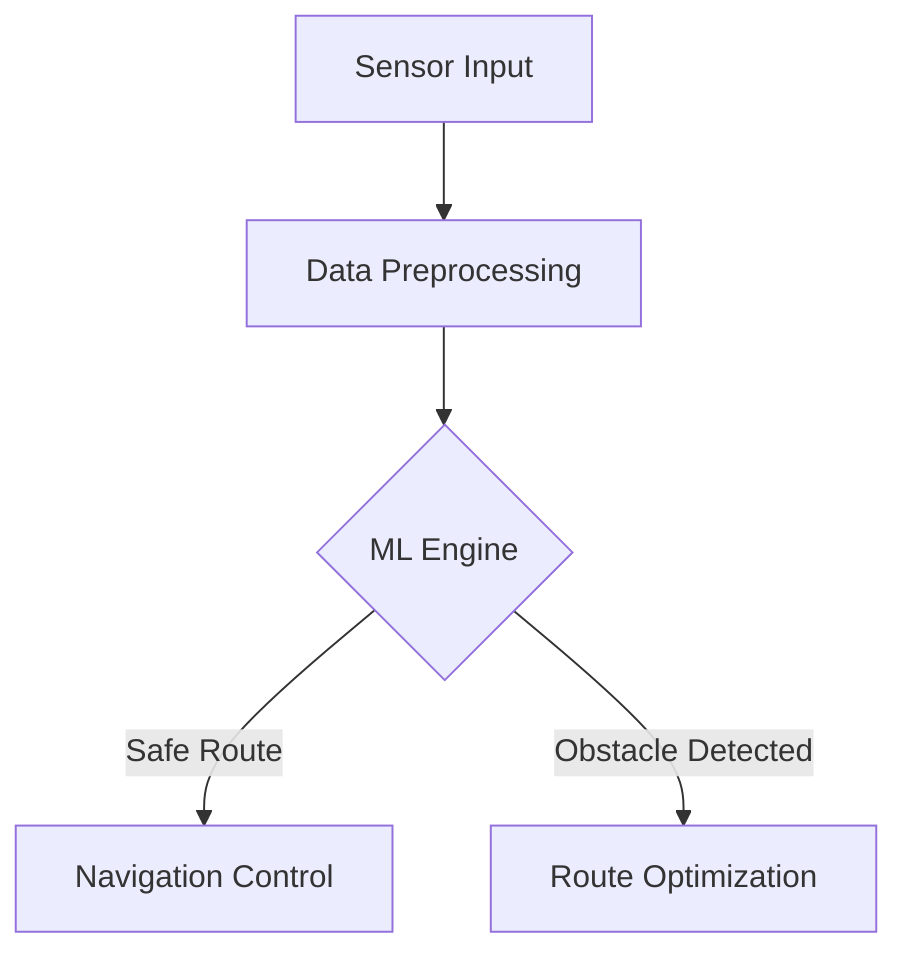
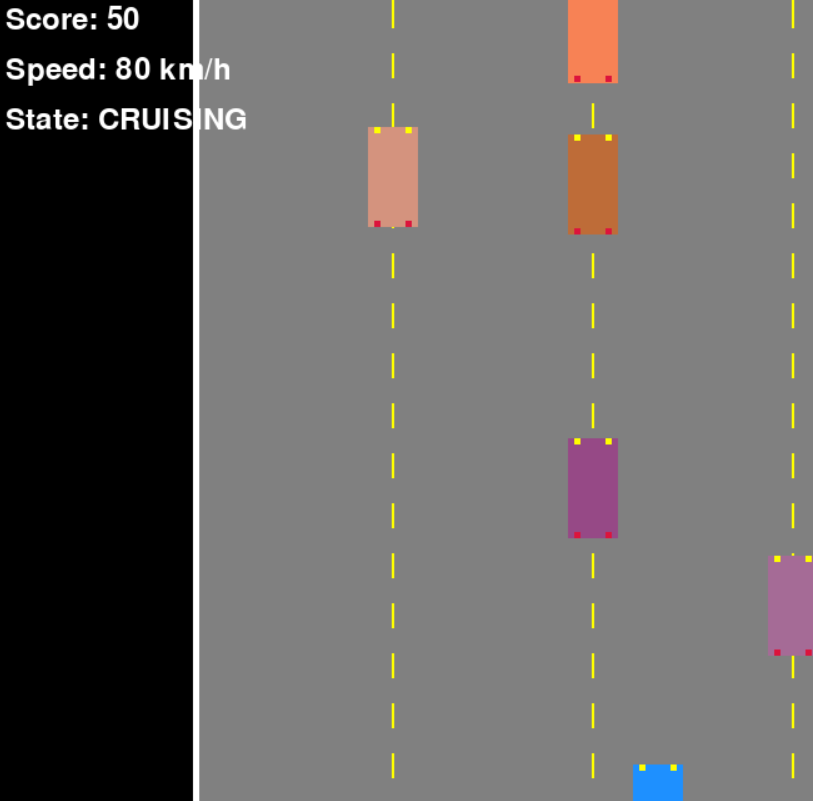

# 🚗 Autonomous Vehicle ML Simulator


## 🌟 Project Showcase

### Interactive Self-Driving Car Simulation
Cutting edge Python based autonomous vehicle simulation leveraging machine learning and advanced sensor technologies.

## 🛠 Technology Stack

| Category | Technologies |
|----------|--------------|
| 🧠 Machine Learning | Mini Datasets |
| 🖥️ Visualization | PyGame, |
| 🤖 Core Languages | Python 3.8+ |

## 🚦 Quick Start

### Prerequisites
- Python 3.8+
- pip package manager

### Installation
```bash
# Clone Repository
 git clone https://github.com/rexzea/self-driving-car.git

# Install Dependencies
pip install -r requirements.txt

```

## 🔍 Project Features

- 🛰️ Sensor Detection
- 🌐 Real time Environmental Mapping
- 🚗 Autonomous Navigation Techniques

## 📊 System Architecture



## 🚀 Project Foundation

- [x] Initial ML Model Development
- [x] Enhanced Sensor Accuracy


## 🤝 Contribution Guidelines

1. Fork the Repository
2. Create Feature Branch
3. Implement Changes
4. Submit Pull Request

## 📜 License
MIT Open Source License

## 🌈 Preview Screenshots




## 👏 Acknowledgments
Inspired by cutting-edge autonomous vehicle research and open-source ML communities.
