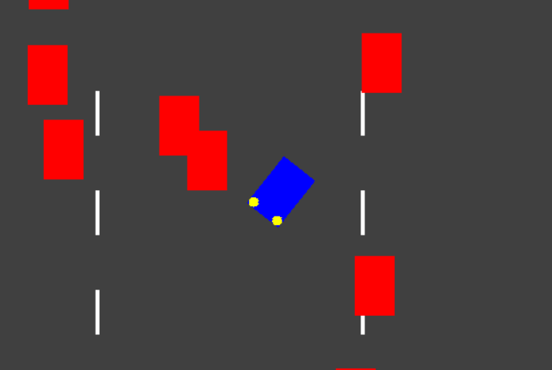
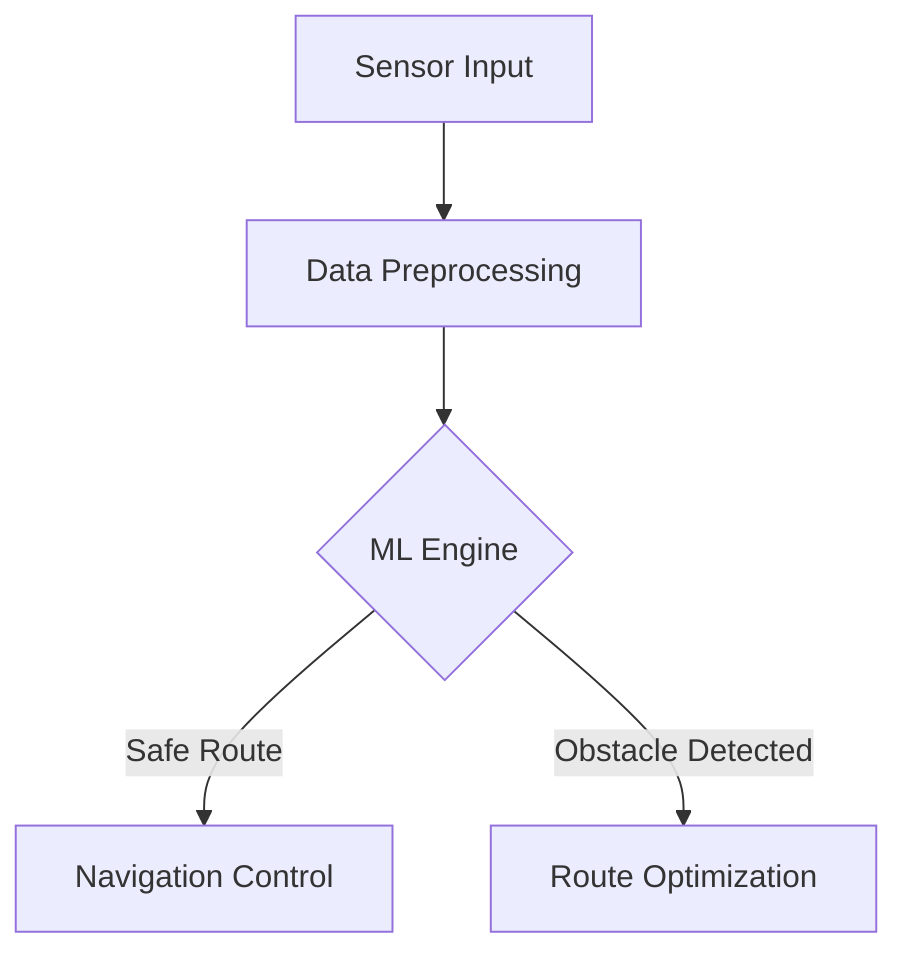
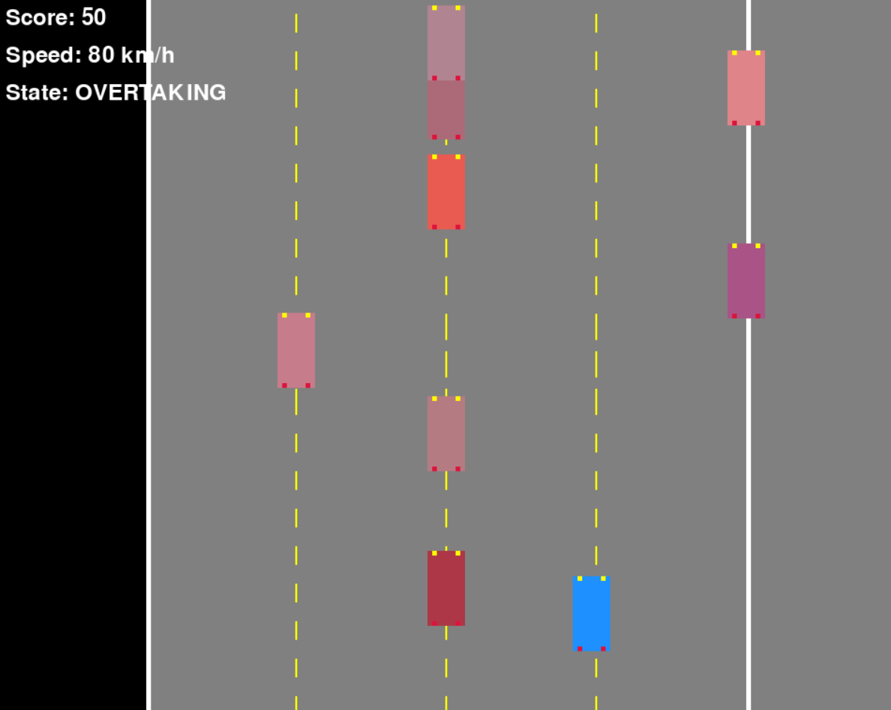
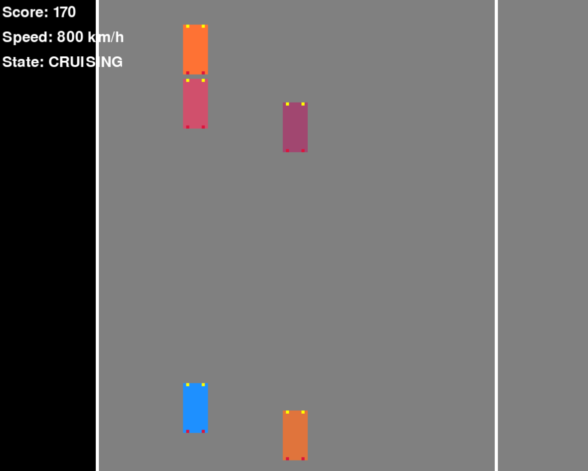

# 🚗 Self Driving Car Simulation PyGame



## 🌟 Project Showcase

### Interactive Self-Driving Car Simulation
Cutting edge Python based autonomous vehicle simulation leveraging machine learning with sensor.

## 🛠 Technology Stack

| Category | Technologies |
|----------|--------------|
| 🧠 Machine Learning | Mini Datasets |
| 🖥️ Visualization | PyGame |
| 🤖 Core Languages | Python 3.8+ |

## 🚦 Quick Start

### Prerequisites
- Python 3.8+
- pip package manager

### Installation
```bash
# Clone Repository
 git clone https://github.com/rexzea/self-driving-car.git

# Install Dependencies
pip install -r requirements.txt

```

## 🔍 Project Features

- 🛰️ Sensor Detection
- 🌐 Real time Environmental Mapping
- 🚗 Autonomous Navigation Techniques

## 📊 System Architecture



## 🚀 Project Foundation

- [x] Initial ML Model Development
- [x] Enhanced Sensor Accuracy


## 🤝 Contribution Guidelines

1. Fork the Repository
2. Create Feature Branch
3. Implement Changes
4. Submit Pull Request

## 📜 License
MIT Open Source License

## 🌈 Preview





## 📞 Support & Contact
Need assistance? Reach out through:
- 📧 Email: [futzfary@gmail.com](mailto:futzfary@gmail.com)
- 📱 Phone: +62 898-8610-455
- 💬 GitHub Issues: Open a new issue in the repository

<div align="center">


```
🌟 Crafted with ❤️ by Rexzea 🌟
```
</div>

---

<div align="center">

### Show Your Support
⭐ Star this repository if you find it helpful! ⭐

[Report Bug](https://github.com/rexzea/self-driving-car/issues) · [Request Feature](https://github.com/rexzea/self-driving-car/issues)
